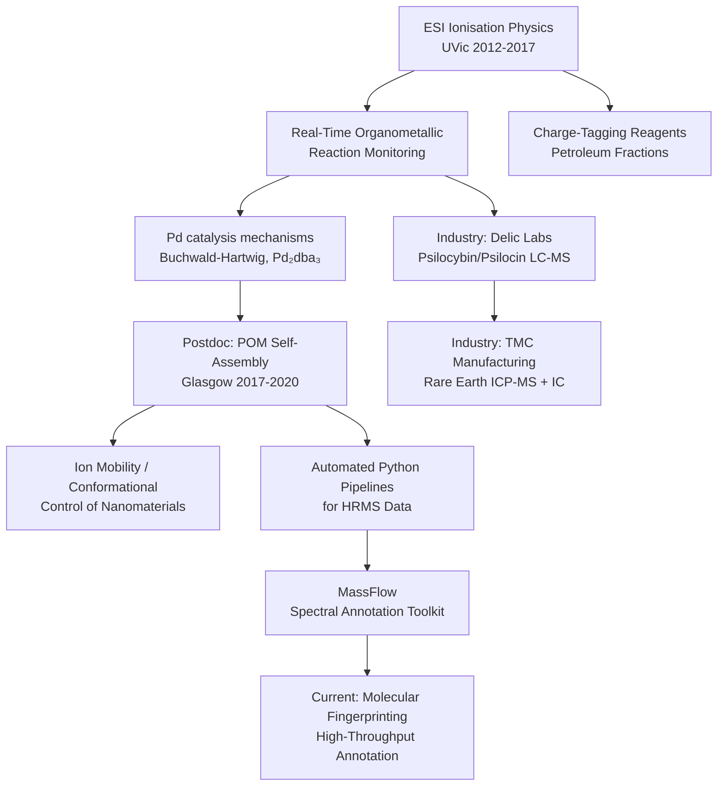

```YAML
title: "Dr. Eric Janusson — Research Summary"
aliases:
  - Eric Janusson
  - Janusson
type: person
tags:
  - researcher
  - mass-spectrometry
  - analytical-chemistry
  - ESI-MS
  - ICP-MS
  - LC-MS
  - organometallics
  - polyoxometalates
  - python
  - computational-chemistry
  - postdoc
  - University-of-Victoria
  - University-of-Glasgow
  - Cronin-Group
created: 2026-06-08
updated: 2026-06-08
status: active
orcid: "0000-0002-3207-7067"
github: "https://github.com/janusson"
website: "https://www.ericjanusson.ca"
scholar: "https://scholar.google.ca/citations?user=PaUrfcQAAAAJ"
researchgate: "https://www.researchgate.net/profile/Eric-Janusson"
location: "North Vancouver, BC, Canada"
```

# Dr. Eric Janusson — Research Summary

> [!info] Quick Reference
> **Role:** Computational Analytical Chemist · Independent Scientific Consultant
> **Affiliation (current):** Self-employed / Independent
> **Previous:** [[TMC Group|TMC Manufacturing]] · [[Delic Labs]] · [[Cronin Group, University of Glasgow]] · [[University of Victoria]]
> **ORCID:** [0000-0002-3207-7067](https://orcid.org/0000-0002-3207-7067)
> **Citations (Google Scholar):** ~223+ | **Publications:** ~15 peer-reviewed

---

## 1. Identity & Research Focus

Dr. Eric Janusson is a **PhD Analytical Chemist and mass spectrometrist** whose career spans fundamental ion-source physics, organometallic mechanistic chemistry, inorganic nanomaterial self-assembly, regulated analytical laboratory operations, and open-source scientific software. His professional self-description — *Computational Analytical Chemist* — reflects a deliberate synthesis of bench expertise and data-science methodology rarely found in a single researcher.

His instrumentation fluency covers the full modern mass spectrometry landscape:

| Platform | Specialization |
|---|---|
| **ESI-MS / ESI-MS/MS** | Ion-source physics, reaction monitoring, ion-pairing |
| **ICP-MS / ICP-OES** | Trace elemental & isotopic ratio analysis, high-purity materials |
| **QTOF / Orbitrap (HRMS)** | Molecular formula elucidation, metabolomics-style annotation |
| **Ion Mobility (TWIMS)** | Gas-phase conformational analysis of large inorganic assemblies |
| **Triple-Quadrupole (QqQ)** | MRM-based quantification, Buchwald-Hartwig catalytic monitoring |
| **GC-MS / GC-QqQ** | Volatile analytes, confirmatory orthogonal screening |
| **LC-MS / LC-MS/MS** | Untargeted and targeted method development; psychoactive & natural products |

He is also a fluent practitioner of **orthogonal methods** — UV-Vis, NMR, FTIR, potentiometric ISE, and ion chromatography — as complements to mass spectrometry.

---

## 2. Education

| Degree | Institution | Year |
|---|---|---|
| **Doctor of Philosophy (PhD), Chemistry** | University of Victoria, BC | 2017 |
| **Bachelor of Science (BSc), Chemistry** | University of Victoria, BC | 2012 |

**PhD Supervisor:** Prof. J. Scott McIndoe (Department of Chemistry, University of Victoria)

---

## 3. PhD Research (2012–2017)

> [!abstract] Dissertation Title
> *Development of Mass Spectrometry Techniques for Real-Time Reaction Monitoring*
> University of Victoria, 2017

### 3.1 Electrospray Ionization Fundamentals

Janusson's doctoral work opened with a systematic investigation of the ESI process itself — a domain he identified as under-characterised relative to its practical importance in analytical MS. Using the ionic liquid cation **butyl-methylimidazolium ([BMIM]⁺)** paired with varied counterions across multiple solvent systems, he mapped the **differential surface activity** of chemically distinct ions as a function of solvent polarity. The key finding: **acetonitrile minimises differential ESI surface effects** compared to methanol or water, making it the preferred solvent when relative ion intensities must be interpreted quantitatively. This work underpins every subsequent application of ESI-MS to reaction monitoring.

### 3.2 Spray-Head Geometry and Instrumental Parameters

A complementary study examined how **physical positioning of the ESI spray head**, combined with temperature, gas-flow rates, and solvent choice, affects the distribution of signal intensity between two co-present ions. The work demonstrated that even minor instrument parameter changes can dramatically alter spectral quality and apparent relative concentrations — a critical practical consideration for any group using ESI-MS for mechanistic or kinetic studies.

### 3.3 Charge-Tagging Reagents for Petroleum Fraction Analysis

In collaboration with an industry partner, Janusson developed **selective charge-tagging reagents** for characterising thiol and disulfide species in complex petroleum matrices by ESI-MS. The derivatisation chemistry exploited charged disulfide reagents that react *exclusively* with thiols in short reaction times, enabling high-selectivity detection of a previously intractable compound class. Utility was demonstrated both by on-line reaction monitoring and in real petroleum fractions. The synthesis was simple and yielded a pure, chemically stable reagent.

### 3.4 Real-Time Monitoring of Pd₂(dba)₃ Activation

A paired **UV-Vis + ESI-MS** platform was used to monitor the real-time activation of the palladium(0) precursor **Pd₂(dba)₃** with sulfonated versions of PPh₃ and a Buchwald-type phosphine ligand. The hyphenated approach allowed simultaneous tracking of the metal oxidation state (UV-Vis) and intermediate speciation (ESI-MS), providing direct insight into the influence of ligand identity and preparation conditions on catalyst activation. This laid the conceptual groundwork for the later MRM-based Buchwald-Hartwig monitoring paper (see §6.2).

### 3.5 Chladni Figures as Atomic Orbital Teaching Aid

A pedagogical contribution developed an **experimental demonstration for first-year chemistry** linking the nodal and anti-nodal patterns of Chladni figures (mechanically vibrated metal plates) to the nodal surfaces of quantum mechanical atomic orbitals. This served as a tactile, visual bridge between standing-wave mathematics and orbital geometry.

---

## 4. Postdoctoral Research — Cronin Group, University of Glasgow (2017–2020)

> [!info] Host Group
> Prof. Leroy Cronin FRS, WestCHEM / School of Chemistry, University of Glasgow
> One of the world's leading groups in digital chemistry, self-assembly, and polyoxometalate science.

### 4.1 Polyoxometalate Self-Assembly via TWIMS and Orbitrap MS

Janusson designed **travelling-wave ion mobility spectrometry (TWIMS)** methods combined with Orbitrap high-resolution MS to characterise the real-time, solution-phase self-assembly of **polyoxometalate (POM) nanomaterials** — structurally rich, high-nuclearity inorganic clusters with applications in catalysis, energy storage, and medicine. Accessing the conformational landscape of these assemblies in the gas phase via ion mobility provided a window into structural intermediates that are inaccessible by conventional crystallography.

### 4.2 Carbohydrate-Mediated Isomer Selection in POM Synthesis

> [!cite] Key Publication
> Janusson, E.; de Kler, N.; Vilà-Nadal, L.; Long, D.-L.; Cronin, L.
> "Synthesis of polyoxometalate clusters using carbohydrates as reducing agents leads to isomer-selection."
> *Chem. Commun.* **2019**, *55*, 5797–5800. DOI: [10.1039/C9CC02361E](https://doi.org/10.1039/C9CC02361E)

Using **sugars as mild reducing agents**, Janusson demonstrated that the self-assembly of polyoxomolybdate clusters could be steered toward a *single* isomer — the Wells-Dawson γ-isomer in 6-fold reduced form — by choice of carbohydrate. D-(-)-Fructose proved significantly more effective than the closely related D-(+)-glucose, revealing subtle steric/electronic substrate discrimination during room-temperature reduction. This **exertion of conformational control** over a self-assembling inorganic nanoparticle was a novel synthetic principle at the time of publication.

### 4.3 Robotic Synthetic-Analytic Platform

Janusson contributed to the Cronin Group's broader programme of **robotic and automated chemistry**, including platforms coupling automated synthesis with in-line MS characterisation — a precursor to what is now widely described as self-driving laboratories.

### 4.4 Automated Python Analytics for High-Dimensionality HRMS Data

To process the large orthogonal, high-dimensionality HRMS datasets generated by the POM programme, Janusson **architected automated Python analytics pipelines** capable of processing multi-source, multi-dimensional spectral data — establishing the methodological foundation that would later crystallise into the MassFlow software package.

---

## 5. Industry Experience

### 5.1 Lead Chemist — Delic Labs, Vancouver, BC (2021–2022)

Delic Labs operated under **Health Canada Section 56 exemptions** for the analysis of scheduled substances (psilocybin/psilocin, cannabinoids, opioids, novel psychoactives). Janusson:

- **Commissioned the analytical facility from the ground up**, including IQ/OQ/PQ for Agilent 6545 QTOF, 7000E GC-QqQ, 1220/1260 LC systems, FTIR, and UV-Vis.
- Established **ISO 17025-aligned QA/QC** protocols and SOPs.
- Developed the most analytically current sample preparation and LC-MS/MS methods for **psilocybin and psilocin**, with specific focus on preventing chemical degradation during extraction and analysis (optimised milling protocols, LC gradient conditions, and ionisation settings).
- Engineered **Python data-processing pipelines** that bypassed vendor-locked software, networking >9,500 compound spectra for untargeted screening and molecular networking.
- Published a rapid quantification method for psilocybin that achieved <0.32% RSD (triplicate, 50 ppm CRM samples) — see §6.1.

> [!tip] Context
> Janusson's psilocybin/psilocin method directly addressed a critical gap: at the time, no validated, high-throughput analytical method existed for these compounds in the emerging therapeutic and commercial landscape.

### 5.2 Research Associate / Acting Analytical Lead — TMC Manufacturing, North Vancouver, BC (2024–2026)

TMC Manufacturing produces **ultra-pure rare-earth stable isotopes** for nuclear and advanced materials applications. Janusson served as primary technical authority for:

- **Industrial-scale magnetic-sector ICP-MS** systems for isotopic ratio analysis at 5N+ purity levels.
- Development of a bespoke **potentiometric chloride-ISE (Cl-ISE) assay** to eliminate halogen contamination in high-purity precursors; achieved <2 ppm detection limits with <5% inter-day CV, and eliminated out-of-specification batch events.
- **$515,000 CAD capital procurement** of a Thermo iCAP MTX 900 triple-quadrupole ICP-MS and Dionex Inuvion IC — authored the full strategic business case and technical specifications, internalising elemental/isotopic purity verification to eliminate >$100,000/year in external lab costs.
- Design of **custom ion sources and co-gas manifolds** for Einzel-type ion optics.
- Engineering of a **comprehensive historical analytical database** for batch consistency tracking, QA/QC root-cause investigation, and propagated uncertainty modelling.

---

## 6. Selected Publications

> [!note] Citation Metrics (as of 2026)
> Google Scholar citations: ~223+ | ResearchGate reads: ~663+
> Peer-reviewed publications: ~15

### 6.1 Psilocybin Quantification (2022)

> Janusson, E.; Samuelsson, A.; Shah, S.; Roggen, M.
> "Rapid quantification of psilocybin using RP-HPLC with single-wavelength detection."
> *Chem. Commun.* **2022** (preprint: ChemRxiv, Oct 2021; DOI: [10.26434/chemrxiv-2021-70mm1](https://doi.org/10.26434/chemrxiv-2021-70mm1))

Developed and validated a reversed-phase HPLC method for efficient quantification of psilocybin (4-phosphoryloxy-*N,N*-dimethyltryptamine) and psilocin using dilute reagents and readily available equipment. Achieved 0.32% RSD on triplicate CRM samples. This remains among the most-cited practical methods for these compounds.

### 6.2 Buchwald-Hartwig Amination Monitoring (2019)

> Thomas, G. T.; Janusson, E.; Zijlstra, H. S.; McIndoe, J. S.
> "Step-by-step real-time monitoring of a catalytic amination reaction."
> *Chem. Commun.* **2019**, *55*, 11727–11730. DOI: [10.1039/C9CC05076K](https://doi.org/10.1039/C9CC05076K)

Used the **multiple reaction monitoring (MRM) mode** of a triple-quadrupole MS to probe individual steps of the Buchwald-Hartwig amination catalytic cycle at **0.1% catalyst loading** in real time via sequential reagent addition. Demonstrated a powerful, practically deployable method for monitoring homogeneous catalysis under realistic conditions.

### 6.3 Polyoxometalate Isomer Selection (2019)

> Janusson, E.; de Kler, N.; Vilà-Nadal, L.; Long, D.-L.; Cronin, L.
> "Synthesis of polyoxometalate clusters using carbohydrates as reducing agents leads to isomer-selection."
> *Chem. Commun.* **2019**, *55*, 5797–5800. DOI: [10.1039/C9CC02361E](https://doi.org/10.1039/C9CC02361E)

Conformational control over a self-assembling POM nanoparticle system via choice of reducing sugar — novel synthetic principle. (See §4.2.)

### 6.4 Pd₂(dba)₃ Activation Monitoring (2017)

> Janusson, E.; Zijlstra, H. S.; *et al.*, McIndoe, J. S.
> "Real-time analysis of Pd₂(dba)₃ activation by phosphine ligands."
> *Chem. Commun.* **2017**

Hyphenated UV-Vis + ESI-MS platform for real-time tracking of palladium(0) precatalyst activation. (See §3.4.)

### 6.5 Additional ESI-MS Fundamentals (UVic, 2012–2017)

Multiple peer-reviewed articles on:

- ESI-MS ion-source behaviour, solvent effects, and differential surface activity
- Ion-pairing phenomena and aggregate ion distributions
- Collision-cell dynamics in ESI-MS/MS
- Spray-head geometry effects on spectral quality

---

## 7. Software Portfolio

### 7.1 MassFlow

> [!tip] Repository
> [github.com/janusson/MassFlow](https://github.com/janusson/MassFlow)

**MassFlow** is a config-first, open-source Python toolkit for high-throughput LC-MS/MS spectral annotation and molecular networking. Core capabilities:

- Ingest spectral data from **MGF and MSP** file formats
- Spectral **cleaning, filtering, and normalisation** pipelines
- Construction of and searching against **local spectral libraries**
- **Similarity network** construction (based on `matchms` cosine scoring)
- Spectral library **curation and QA**
- Designed for reproducibility: configuration-driven, not script-hacked

Built on the `matchms` and `pyteomics` ecosystems. MassFlow reflects Janusson's conviction that spectral annotation should be reproducible, automated, and decoupled from vendor-locked instrument software.

> [!note] Design Philosophy
> MassFlow is config-first: analysis parameters live in structured configuration files, not scattered across notebooks. This enables version-controlled, reproducible spectral workflows — a direct response to the reproducibility problems Janusson encountered in both academic and industry settings.

### 7.2 PySharpe

> [!tip] Repository
> [github.com/janusson/PySharpe](https://github.com/janusson/PySharpe)

Python toolkit for **statistical modelling, uncertainty analysis, and portfolio optimisation**. Provides a Streamlit web interface for testing asset allocation and dollar-cost-averaging strategies. Reflects Janusson's quantitative analytical style applied to financial data.

---

## 8. Core Competencies Summary

```python
Mass Spectrometry           ████████████████████  ICP-MS, ESI-MS/MS, QTOF, Orbitrap, TWIMS, QqQ, GC-MS
LC-MS Method Development    ███████████████████   Reversed-phase, gradient optimisation, untargeted/targeted
Sample Preparation          ██████████████████    SPE, digestion, milling, extraction, derivatisation
Python / Data Science       ████████████████      pandas, matchms, pyteomics, Streamlit, automation
Vacuum Technology           ███████████████       HV/UHV systems, turbomolecular pumps, ion optics
Laboratory Leadership       ██████████████        ISO 17025, SOP authoring, staff mentorship, procurement
Regulatory Compliance       █████████████         Health Canada Section 56, WHMIS 2015, chain-of-custody
```

---

## 9. Research Themes & Intellectual Trajectory



---

## 10. Linked Notes & Cross-References

- [[Electrospray Ionization]]
- [[Ion Mobility Spectrometry]]
- [[Polyoxometalates]]
- [[Buchwald-Hartwig Amination]]
- [[matchms]]
- [[ICP-MS]]
- [[J. Scott McIndoe]]
- [[Leroy Cronin]]
- [[Cronin Group]]
- [[Delic Labs]]
- [[TMC Manufacturing]]
- [[MassFlow]]
- [[PySharpe]]

---

## 11. External Links

| Resource | URL |
|---|---|
| GitHub | https://github.com/janusson |
| Personal Website | https://www.ericjanusson.ca |
| ORCID | https://orcid.org/0000-0002-3207-7067 |
| Google Scholar | https://scholar.google.ca/citations?user=PaUrfcQAAAAJ |
| ResearchGate | https://www.researchgate.net/profile/Eric-Janusson |
| MassFlow Repo | https://github.com/janusson/MassFlow |
| PySharpe Repo | https://github.com/janusson/PySharpe |

---

*Last updated: 2026-06-08 · Source: CV, dissertation abstract, web research, publication databases*
