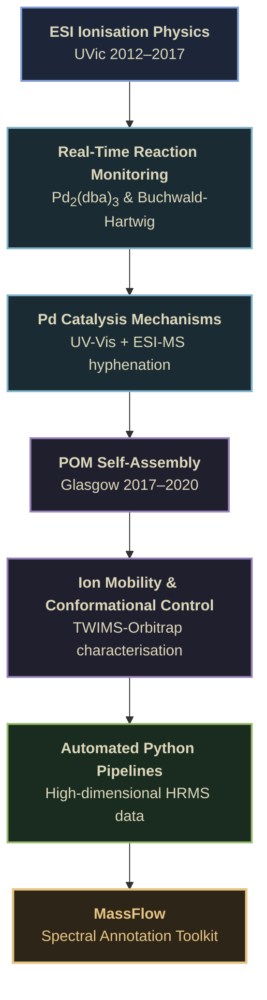

# About Me

<a href="/cv/" class="btn btn--primary btn--large">Download CV (PDF) &rarr;</a>

## From the Bench to the Terminal

I am a **Computational Analytical Chemist** specializing in mass spectrometry and custom data architecture. After spending over a decade working directly with complex instrumentation—from fundamental ion-source physics to regulated industrial validation—I recognized a persistent bottleneck: proprietary, vendor-locked software that throttles discovery. Today, I build reproducible, open-source Python pipelines designed to decouple high-dimensional spectral analysis from instrument constraints.

My background is rooted in both academic rigor and industrial execution, allowing me to speak the language of both the laboratory and the engineering team.

## Research Trajectory

My research has consistently been driven by a single question: *how do we extract meaningful chemical information from complex mixtures?* This thread runs from the fundamental physics of electrospray ionization, through real-time organometallic reaction monitoring, to conformational analysis of self-assembling nanomaterials, and ultimately to the config-first software pipelines I build today. Each phase has added a layer — deeper instrumentation fluency, broader analytical scope, and more rigorous data architecture.

## Professional & Academic Journey

*   **Independent Scientific Consultant & Software Developer (Jan 2023 – Present):** Providing specialized technical advisement and building custom data-engineering pipelines for analytical environments.
*   **TMC Group (2024 – 2026):** Served as Acting Technical Lead for industrial-scale rare-earth stable isotope production. I managed high-purity ICP-MS operations, developed a bespoke Cl-ISE assay that eliminated out-of-specification batch events, and directed $515K CAD in capital procurement — internalizing elemental/isotopic purity verification and eliminating >$100,000/year in external lab costs.
*   **Delic Labs (2021 – 2022):** Commissioned a federally authorized (Health Canada Section 56) analytical facility from the ground up. I developed a validated psilocybin quantification method achieving <0.32% RSD and engineered Python pipelines that networked >9,500 compound spectra for untargeted metabolomics.
*   **University of Glasgow / Cronin Group (2017 – 2020):** As a Postdoctoral Scholar, I utilized ion mobility (TWIMS) and Orbitrap HRMS to exert conformational control over self-assembling polyoxometalate nanomaterials. This involved architecting automated Python analytics to process orthogonal, high-dimensional datasets.
*   **University of Victoria (2012 – 2017):** Earned my PhD in Analytical Chemistry, mapping the fundamentals of electrospray ionization (ESI) and real-time reaction monitoring for organometallic catalysis.

## Core Competencies

*   **Mass Spectrometry Landscape:** Deep operational expertise across ESI-MS, ICP-MS, QTOF, Orbitrap, TWIMS, and Triple-Quadrupole (QqQ) platforms.
*   **Scientific Computing:** Extensive use of Python (pandas, polars, matchms, pyteomics) for large-scale multidimensional dataset management, statistical modeling, and automated databasing.
*   **Regulatory & Quality Frameworks:** Design and implementation of ISO/IEC 17025 QA/QC architecture and experience maintaining Health Canada Section 56 controlled-substance licensing.

## Software Architecture & Open-Source

*   **[MassFlow](https://github.com/janusson/massflow):** A config-first, version-controlled toolkit for reproducible MS/MS spectral annotation, local spectral-library construction, and molecular networking — built on the matchms and pyteomics ecosystems.
*   **[PySharpe](https://github.com/janusson/pysharpe):** A modular library for quantitative finance, focusing on portfolio optimization, risk-adjusted performance metrics, and uncertainty analysis.

→ [Full list of publications on ORCID](https://orcid.org/0000-0002-3207-7067)

## Beyond the Bench

My development environment is as deliberate as my laboratory setup. I build scientific and financial software with **Python**, write every line in the **Zed editor**, version everything through **GitHub**, and increasingly pair with **AI coding agents** to accelerate architecture, testing, and documentation. The same rigour I bring to an LC-MS method — reproducibility, validation, clean design — carries directly into how I structure code. Terminal-first, config-driven, and built for the long haul.
